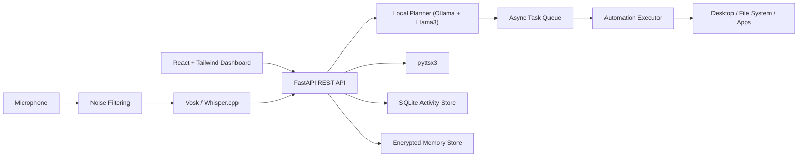

# System Architecture

## Overview

## Core Modules

- `backend/app/api`: REST endpoints for command submission, voice transcription, analytics, history, active runs, memory, settings, and local auth.
- `backend/app/services/planner.py`: turns natural language into strict task JSON using Ollama first and a deterministic fallback parser second.
- `backend/app/services/queue.py`: parallel-safe producer queue with a single desktop worker to avoid conflicting UI automation.
- `backend/app/services/executor.py`: executes `open_app`, `navigate_directory`, `search_file`, `open_file`, `type_text`, `click`, `wait`, and `open_url`.
- `backend/app/storage/sqlite_store.py`: SQLite persistence for command history, task steps, statuses, timestamps, and analytics aggregation.
- `backend/app/voice_module`: offline STT/TTS plus basic noise cleaning.
- `backend/app/memory_module`: encrypted local memory records using Fernet.
- `ui/src`: responsive monitoring dashboard for command entry, voice capture, live status, history, analytics, and settings.

## Execution Flow

1. User sends text or voice command.
2. Backend detects language and asks Ollama to output ordered task JSON.
3. Command, plan, and metadata are stored in SQLite.
4. Task run is pushed to the queue.
5. Background worker executes each step sequentially.
6. Every step status and result is written back to SQLite.
7. Dashboard polls history, active runs, analytics, and memory to show real-time progress.

## Offline Guarantees

- LLM requests target only local Ollama.
- Speech recognition is designed for local Vosk or Whisper.cpp.
- Speech output uses local `pyttsx3`.
- Database is SQLite on disk.
- Long-term memory is encrypted locally.
- No cloud telemetry, analytics, or hosted storage are used.

## Security Notes

- Optional local login is supported through environment flags.
- SQLite database permissions are restricted when the OS allows it.
- Sensitive conversational memory is encrypted with a key derived from `ASSISTANT_SECRET`.
- Desktop automation is serialized through one worker to reduce accidental concurrent input conflicts.

## Language Support

- English
- Hindi
- Telugu

Language routing is detected from the input text and preserved in command history for analytics and auditing.
